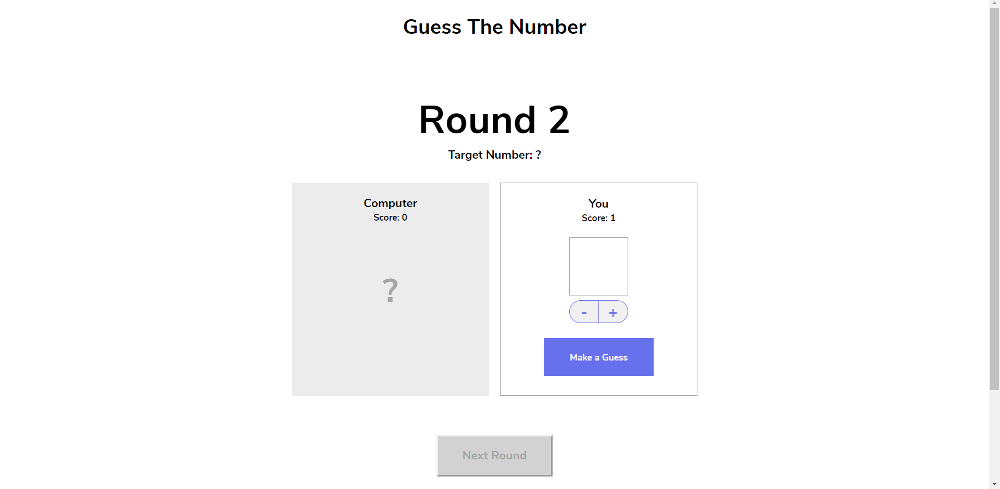

# Guess-The-Number 

This is a browser game made for fun. This is about to guess a close number of randomly generated number and on this challange you are competing with computer who is also generating number randomly from 0 to 10.

## Basic Rule set:
Like any other game this game follows some logic and rules.This game is about to guess a number which is close to the randomly generated number.

  

## This game build with:

>`HTML`  
>`CSS`   
>`JavaScript` 

## `HTML`  
1. First we chose a Heading for our page which is showing the name of the game `Guess The Number`
2. Another `Heading` which is displaying the number of rounds been played.Round number is `span` and given an `id`.
3. Used `
` to display `Target Number` & number is `span` and given an `id`.
4. Added two(2) players `Name` and their `score` board to record their winnings.
5. Added two(2) `button`. One is to `increase and decrease` number and another is a kind of submit button which `submits user input`.
6. Below the page we sets instruction of game.

## `Css`

